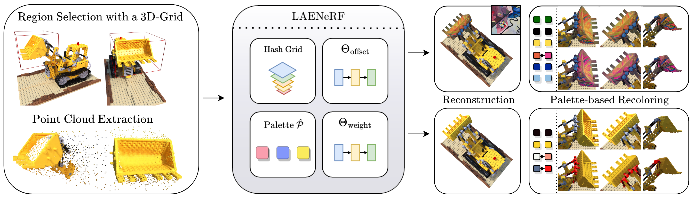
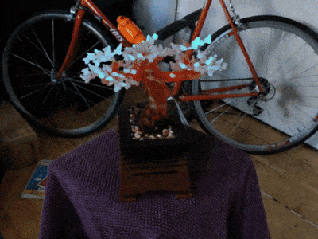
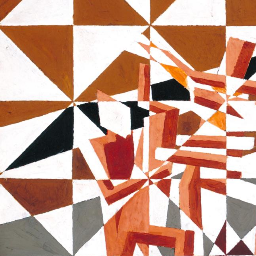
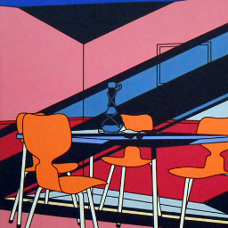
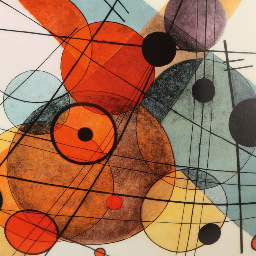
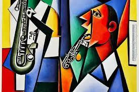

# LAENeRF: Local Appearance Editing for Neural Radiance Fields
### [Lukas Radl](https://r4dl.github.io/), [Michael Steiner](https://online.tugraz.at/tug_online/visitenkarte.show_vcard?pPersonenId=2999CD2743C7E977&pPersonenGruppe=3), [Andreas Kurz](https://scholar.google.com/citations?user=3yD4NZgAAAAJ&hl=de&oi=ao), [Markus Steinberger](https://www.markussteinberger.net/)
##### Institute of Computer Graphics and Vision, Graz University of Technology
#### [Project Page](https://r4dl.github.io/LAENeRF/) | [Preprint](https://arxiv.org/pdf/2306.00696.pdf) | [Video](https://youtu.be/HwQ1x0Fb2Qc)

<p align="middle">
    
</p>
<p align="middle">
    
    
    
    
</p>

We present LAENeRF, a method for **L**ocal **A**ppearance **E**diting of **Ne**ural **R**adiance **F**ields.
This repository contains the official implementation, based on [torch-ngp](https://github.com/ashawkey/torch-ngp).

## Installation
First, clone our repository
```bash
git clone https://github.com/r4dl/LAENeRF.git
cd LAENeRF
```
Next, setup the conda environment using:
```bash
conda env create -f environment_laenerf.yml
conda activate LAENeRF
```
Finally, install [tiny-cuda-nn](https://github.com/NVlabs/tiny-cuda-nn).
```bash
pip install git+https://github.com/NVlabs/tiny-cuda-nn/#subdirectory=bindings/torch
```
### Build extension (optional)
As torch-ngp does, we can build the extensions at run-time (which may be slower), or use `setup.py`:
```bash
bash scripts/install_ext.sh

# or
cd raymarching
python setup.py build_ext --inplace 
pip install . 
```

## Data Preparation
We use the same data format torch-ngp and use the scripts from PaletteNeRF.
Currently, three datasets are supported: [NeRF Synthetic](https://drive.google.com/drive/folders/128yBriW1IG_3NJ5Rp7APSTZsJqdJdfc1), [LLFF](https://drive.google.com/drive/folders/14boI-o5hGO9srnWaaogTU5_ji7wkX2S7) and [mip-NeRF 360](http://storage.googleapis.com/gresearch/refraw360/360_v2.zip). 
The folder structure should look like the following:
```
LAENeRF
├── ...
├── data
│   ├── nerf_synthetic
│   │   ├── lego
│   │   └──  ...
│   ├── llff
│   │   ├── fern
│   │   └──  ...
│   ├── mip360
│   │   ├── bonsai
│   │   └──  ...
└── ...
```
For LLFF and mip-NeRF 360, data conversion is required:
```bash
# mip-NeRF 360
python scripts/llff2nerf.py /path/to/the/scene/directory --images images_4 --downscale 4 --datatype mip360
# LLFF
python scripts/llff2nerf.py /path/to/the/scene/directory --images images_4 --downscale 4 --datatype masks
```

## Training a NeRF
We provide scripts to encapsulate every stage of training.
To obtain a pre-trained NeRF, first run
```bash
bash scripts/run_{dataset}.sh scripts/configs_{dataset}/{scene}.sh -m nerf
```
where dataset is one of {nerf_synthetic, llff, mip360}, for example:
```bash
bash scripts/run_llff.sh scripts/configs_llff/flower.sh -m nerf
```
## NeRF Appearance Editing
Stylization or Recoloring can be performed with the same script, by switching the `-m` argument:
```bash
bash scripts/run_{dataset}.sh scripts/configs_{dataset}/{scene}.sh -m recolor
bash scripts/run_{dataset}.sh scripts/configs_{dataset}/{scene}.sh -m style
```
### Results
By default, we write the results to `test/{scene}_{style, recolor}`.
In this directory, we additionally save test/val set images, a video, the trained LAENeRF (which may be loaded for recolorable stylization),
the fine-tuned NeRF and the grids.

### Style Images
We provide a subset of style images in the `style_images` directory. 
Per-default, *the great wave* is loaded for stylization.

<p align="middle">
    
    
    
    
    
</p>

## Evaluation
We provide our evaluation scripts for our quantitative results to enable more future research in this direction.
All necessary scripts are located in the `scripts/eval` directory, with the required masks contained in the `scripts/eval/masks` directory.

### MSE in the background
To evaluate the MSE in the background with respect to the ground truth test set images, run
```bash
# mip-NeRF 360
python scripts/eval/mse_background_mip360.py --scene {scene} --results_dir {results_dir}
# LLFF
python scripts/eval/mse_background_llff.py --scene {scene} --results_dir {results_dir}
```
Further, to compare to images from a pre-trained NeRF, provide a `--comparison_dir`. 
To save the difference images as well as the results as a json file, provide a `--save_dir`.

### View Consistency
To evaluate view-consistency, clone [RAFT](https://github.com/princeton-vl/RAFT), 
install the conda environment according to their README.md and download their models.
Copy `scripts/eval/consistency_metrics.py` in the `RAFT` directory.
Finally, to obtain view-consistency metrics:
```bash
# Short-Range Consistency
python consistency_metrics.py --model=models/raft-sintel.pth --directory_gt={path_to_nerf_frames} --directory={path_to_stylized_frames} --step 1
# Long-Range Consistency
python consistency_metrics.py --model=models/raft-sintel.pth --directory_gt={path_to_nerf_frames} --directory={path_to_stylized_frames} --step 7
```
Here, `{path_to_nerf_frames}` is a directory which contains frames from a video rendered by a pre-trained NeRF. 
`{path_to_stylized_frames}` is a directory which contains the same frames from a recoloring/stylization method. 
Importantly, we compute the optical flow from the former, and measure MSE with the latter.

## Citation
If you find our work useful, consider citing us with:
```bibtex
@article(Radl2023laenerf,
  title     = {{LAENeRF: Local Appearance Editing of Neural Radiance Fields}},
  author    = {Radl, Lukas and Steiner, Michael and Kurz, Andreas and Steinberger, Markus},
  journal   = {arXiv preprint arXiv:},
  year      = {2023},
}
```

## Acknowledgements
The implementation of Instant-NGP is adapted from [torch-ngp](https://github.com/ashawkey/torch-ngp):
```bibtex
@misc{torch-ngp,
  Author    = {Jiaxiang Tang},
  Year      = {2022},
  Note      = {https://github.com/ashawkey/torch-ngp},
  Title     = {Torch-ngp: a PyTorch implementation of instant-ngp}
}

@article{tang2022compressible,
  title     = {Compressible-composable NeRF via Rank-residual Decomposition},
  author    = {Tang, Jiaxiang and Chen, Xiaokang and Wang, Jingbo and Zeng, Gang},
  journal   = {arXiv preprint arXiv:2205.14870},
  year      = {2022}
}
```
Some elements of the GUI as well as scripts for data conversion and running our method are adapted from [PaletteNeRF](https://github.com/zfkuang/PaletteNeRF/). 
```bibtex
@article{kuang2022palettenerf,
  title     = {PaletteNeRF: Palette-based Appearance Editing of Neural Radiance Fields},
  author    = {Kuang, Zhengfei and Luan, Fujun and Bi, Sai and Shu, Zhixin and Wetzstein, Gordon and Sunkavalli, Kalyan},
  journal   = {arXiv preprint arXiv:2212.10699},
  year      = {2022}
}
```
The segmentation masks for Mip-NeRF 360 were extracted with [Segment Anything](https://github.com/facebookresearch/segment-anything),
and the masks for LLFF were given to use by the authors of [ICE-NeRF](https://heuyklee.github.io/ice-nerf/).
```bibtex
@article{kirillov2023segany,
  title     = {Segment Anything},
  author    = {Kirillov, Alexander and Mintun, Eric and Ravi, Nikhila and Mao, Hanzi and Rolland, Chloe and Gustafson, Laura and Xiao, Tete and Whitehead, Spencer and Berg, Alexander C. and Lo, Wan-Yen and Doll{\'a}r, Piotr and Girshick, Ross},
  journal   = {arXiv:2304.02643},
  year      = {2023}
}

@InProceedings{Lee_2023_ICCV,
  author    = {Lee, Jae-Hyeok and Kim, Dae-Shik},
  title     = {ICE-NeRF: Interactive Color Editing of NeRFs via Decomposition-Aware Weight Optimization},
  booktitle = {Proceedings of the IEEE/CVF International Conference on Computer Vision (ICCV)},
  month     = {October},
  year      = {2023},
  pages     = {3491-3501}
}
```