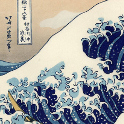

# LAENeRF
We present LAENeRF, a method for **L**ocal **A**ppearance **E**diting of **Ne**ural **R**adiance **F**ields. \
\
 \
\


## Installation
First, setup the conda environment using:
```bash
conda env create -f environment_laenerf.yml
conda activate LAENeRF
```
Next, install tiny-cuda-nn.
```bash
pip install git+https://github.com/NVlabs/tiny-cuda-nn/#subdirectory=bindings/torch
```
### Build extension (optional)
As torch-ngp does, we can build the extensions at run-time (which may be slower), or use `setup.py`:
```bash
bash scripts/install_ext.sh

# or
cd raymarching
python setup.py build_ext --inplace 
pip install . 
```

## Data Preparation
We use the same data format torch-ngp and use the scripts from PaletteNeRF.
Currently, three datasets are supported: [NeRF Synthetic](https://drive.google.com/drive/folders/128yBriW1IG_3NJ5Rp7APSTZsJqdJdfc1), [LLFF](https://drive.google.com/drive/folders/14boI-o5hGO9srnWaaogTU5_ji7wkX2S7) and [mip-NeRF 360](http://storage.googleapis.com/gresearch/refraw360/360_v2.zip). 
The folder structure should look like the following:
```
code
├── ...
├── data
│   ├── nerf_synthetic
│   │   ├── lego
│   │   └──  ...
│   ├── llff
│   │   ├── fern
│   │   └──  ...
│   ├── mip360
│   │   ├── bonsai
│   │   └──  ...
└── ...
```
For LLFF and mip-NeRF 360, data conversion is required:
```bash
# mip-NeRF 360
python scripts/llff2nerf.py /path/to/the/scene/directory --images images_4 --downscale 4 --datatype mip360
# LLFF
python scripts/llff2nerf.py /path/to/the/scene/directory --images images_4 --downscale 4 --datatype llff
```

## Training a NeRF
We provide scripts to encapsulate every stage of training.
To obtain a pre-trained NeRF, first run
```bash
bash scripts/run_{dataset}.sh scripts/configs_{dataset}/{scene}.sh -m nerf
```
where dataset is one of {nerf_synthetic, llff, mip360}, for example:
```bash
bash scripts/run_llff.sh scripts/configs_llff/flower.sh -m nerf
```
## NeRF Appearance Editing
Stylization or Recoloring can be performed with the same script, by switching the `-m` argument:
```bash
bash scripts/run_{dataset}.sh scripts/configs_{dataset}/{scene}.sh -m recolor
bash scripts/run_{dataset}.sh scripts/configs_{dataset}/{scene}.sh -m style
```
### Results
By default, we write the results to `test/{scene}_{style, recolor}`.
In this directory, we additionally save test/val set images, a video, LAENeRF (which may be loaded for recolorable stylization),
the fine-tuned NeRF and the grids.

### Style Images
We provide a subset of style images in the `style_images` directory. 
Per-default, *the great wave* is loaded for stylization.
\
\





